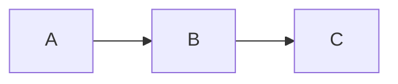

# Authoring Guide

How to write content for this blog. Companion to `PORTABILITY.md`
(rules) and `ROADMAP.md` (what's planned). When in doubt, check this
file first.

## Quickstart

1. In Obsidian, create a file in `Blog/` (it's the symlink folder).
2. Paste this frontmatter:
   ```yaml
   ---
   title: My Post
   description: One-line summary, 12 words.
   publish: true
   publishDate: 2026-05-01
   tags: [meta]
   ---
   ```
3. Write markdown.
4. `bun run dev` (or it's already running); the post HMRs into
   `http://localhost:4321/posts/my-post/`.

That's the whole loop.

---

## Content types

`type` field in frontmatter picks one of four. Default `post` if omitted.

| Type      | URL                  | Use for                                       |
| --------- | -------------------- | --------------------------------------------- |
| `post`    | `/posts/<slug>/`     | Long-form articles, guides, opinions, ADRs    |
| `note`    | `/notes/<slug>/`     | TIL / short fragments / half-formed thoughts  |
| `project` | `/projects/<slug>/`  | Portfolio entries, side projects, demos       |
| `page`    | `/<id>/` (special)   | Single static pages — currently `now`, `uses` |

Decision rule: **does it change layout or URL?** → `type`. Otherwise → `tags`.

---

## Frontmatter reference

| Field           | Type              | Required | Default | Notes                                                                |
| --------------- | ----------------- | :------: | ------- | -------------------------------------------------------------------- |
| `title`         | string ≤ 60       |    ✅    | —       | Build fails if longer than 60 chars                                  |
| `description`   | string            |    ✅    | —       | Used in OG meta, RSS, listings                                       |
| `publish`       | boolean           |    ✅    | `false` | **Default false (private).** Must explicitly set `true` to ship      |
| `publishDate`   | date / ISO string |    ✅    | —       | YYYY-MM-DD or ISO datetime; first publish date                       |
| `updatedDate`   | date              |          | —       | Auto-filled from git mtime if omitted; manually overriding is fine   |
| `type`          | enum              |          | `post`  | `post` \| `note` \| `project` \| `page`                              |
| `tags`          | string[]          |          | `[]`    | Lowercase, hyphenated. 1-4 tags per post is the sweet spot           |
| `series`        | string            |          | —       | Series name (free-form). Posts sharing the same string get grouped   |
| `seriesOrder`   | int ≥ 1           |          | —       | Position in series; needed for prev/next nav                         |
| `status`        | enum              |          | —       | `seedling` 🌱 / `growing` 🌿 / `evergreen` 🌳 — digital-garden badge |
| `pinned`        | boolean           |          | `false` | Top-3 pinned posts feature on home page                              |
| `coverImage`    | object            |          | —       | `{ src: "./img.png", alt: "..." }` for hero image                    |
| `ogImage`       | string            |          | —       | Override auto-generated social card                                  |
| `lang`          | BCP-47 string     |          | site lang | `en`, `zh-TW`, `ja`, … — drives `<html lang>` + switcher label    |
| `translationKey`| string            |          | —       | Shared id between translations of the same post                      |

Obsidian-only fields like `created`, `updated` are ignored by the
schema (no error). Don't reference framework paths in frontmatter.

---

## Markdown features

### Wikilinks `[[X]]`

```markdown
[[hello-world]]                  → /posts/hello-world/  (real link)
[[some-private-thought]]         → "some-private-thought"  (plain text — leak guard)
[[hello-world|click here]]       → "click here"  (alias)
[[hello-world#heading]]          → not supported, falls through to plain text
```

Resolution: build-time scan of all `publish: true` posts. If the target
matches a published post id, render as link. Otherwise plain text.
Private vault notes never appear as broken links on the live site.

### Obsidian callouts `> [!type]`

```markdown
> [!note] Optional title
> Body line 1
> Body line 2

> [!tip]
> Pro tip body.

> [!warning]
> Read this carefully.
```

Five visual variants (Cactus admonitions): `note`, `tip`, `important`,
`warning`, `caution`. Many Obsidian aliases are mapped:

| Obsidian type                    | Renders as |
| -------------------------------- | ---------- |
| note, info, abstract, summary    | note       |
| tip, hint, success, question     | tip        |
| important                        | important  |
| warning, attention               | warning    |
| caution, danger, error, bug      | caution    |

Folding markers `+` (open by default) / `-` (collapsed) are accepted in
the source but the live site always renders them open.

### Highlight `==text==`

```markdown
This is ==important== context.
```

Renders as semantic `<mark>` element.

### Math (KaTeX)

```markdown
Inline: $E = mc^2$, $\sum_{i=1}^n i = \frac{n(n+1)}{2}$.

Block:

$$
\int_0^\infty e^{-x^2}\,dx = \frac{\sqrt{\pi}}{2}
$$
```

### Mermaid diagrams

````markdown

````

Lazy-loaded only on pages that contain a diagram. Re-renders when you
toggle the site theme.

### Images

```markdown
![[image.png]]            ← put image.png next to the .md file
![[image.png|320]]        ← width hint (becomes )
         ← also works (standard markdown)
       ← external is fine
```

For `![[X]]`, the file is **copied to `public/posts/<slug>/X`** at build
time. If the file isn't found alongside the .md, the embed is silently
dropped (no broken-image icon).

### Code blocks

````markdown
```ts
function ping() { return "pong" }
```
````

Syntax highlighting + copy button via expressive-code (already wired).
Themes: `dracula` for dark, `github-light` for light.

### Tables, lists, footnotes

Standard markdown. Tables get `display: block; overflow-x: auto` on
mobile so they don't blow out the layout.

---

## Status badge — when to use which

| Status        | Meaning                                         | Use when                              |
| ------------- | ----------------------------------------------- | ------------------------------------- |
| `seedling` 🌱 | "Just planted. Half-formed. May be wrong."      | First draft, idea you're testing      |
| `growing` 🌿  | "Worked through it once. Will revise."          | Refined draft, awaiting verification  |
| `evergreen` 🌳 | "Considered settled. Update only if I'm wrong."| Long-tested take, mature reference    |

Omitting the field → no badge. That's normal for transient posts.
Decision Log entries stay `seedling` until the **Reflection** section is
filled (months later usually).

---

## Series — when to use

Use only when posts must be read in order. Two posts on the same topic
that don't depend on each other → use a `tag`, not a series.

```yaml
# Part 1
series: "Building my homelab"
seriesOrder: 1

# Part 2
series: "Building my homelab"
seriesOrder: 2
```

Effects: per-post "Part X of Y" badge with prev/next, `/series/`
auto-index, `/series/<slug>/` ordered list page.

---

## Translations (minimal viable i18n)

Site is single-language by default. To translate **a specific post**:

1. Write the original (say in English):
   ```yaml
   ---
   title: Building my homelab
   lang: en
   translationKey: homelab-2026
   publish: true
   …
   ---
   ```
2. Write the translation as a sibling file (different slug):
   ```yaml
   ---
   title: 打造我的 homelab
   lang: zh-TW
   translationKey: homelab-2026   # SAME key as the original
   publish: true
   …
   ---
   ```
3. Both posts auto-discover each other and show "Also available in: …"
   at the top.

Rules:
- `translationKey` is any string — pick something stable (slug-like).
- Same key on two posts links them; on three+ posts links all of them.
- Omitting `translationKey` opts out — the post stays single-language.
- `lang` defaults to the site language (English) so most posts don't
  need it. Only set it when you mean a non-default language.

This is **opt-in per post**. We never duplicate every article — only
translate the few that earn it.

## Templates

Obsidian Templates plugin → `Insert template` → `Decision Log`.
The `.md` lives at `templates/Decision Log.md` (vault sees it via
symlink at `Obsidian/Templates`).

Templates are author scaffolds, **not** publishable content. They live
outside `src/content/` so Astro's schema validator never sees them.

When to write a Decision Log: any time you'll regret in 6 months not
having written down "why I chose A over B". Library/framework picks,
architecture cuts, deletion decisions.

---

## Things that don't render

These constructs are stripped or rendered raw — know about them:

| Source                  | Result on site                              |
| ----------------------- | ------------------------------------------- |
| `%%hidden comment%%`    | **Removed entirely** (privacy guard)         |
| `^block-id` (trailing)  | Removed                                     |
| `![[transclusion]]`     | Removed (no embed support yet)              |
| `[/] [?] [!]` task states | Render as raw text                         |
| `[[note#heading]]`      | Falls through to plain text                 |
| Inline `#tag` in body   | Renders as raw `#tag` text                  |

If you find yourself wanting one of these, frontmatter is the answer
in most cases.

---

## Workflow

1. **Write in Obsidian.** The vault `Blog/` folder is symlinked to
   `src/content/post/`. Files HMR live in dev.
2. **Don't worry about `updatedDate`.** Git mtime fills it.
3. **Keep `publish: false` until you mean it.** Default is private —
   the schema enforces opt-in.
4. **When you `git commit`, the pre-commit hook runs:**
   - Blocks iCloud sync conflict files (` 2.md`, `(conflicted)`)
   - Blocks obvious secret patterns (AWS keys, GH PATs, etc.)
   - Warns on `[[wikilinks]]` to targets not in
     `scripts/git-hooks/wikilinks-allowlist.txt`
5. **Before each `bun run dev` / `bun run build`** an iCloud-conflict
   scanner runs automatically (`scripts/check-vault-conflicts.mjs`).

---

## Tag taxonomy hints

Keep tags **lowercase + hyphenated** (`system-design`, not `System Design`).
The schema enforces this on input (lowercases automatically).

A loose hierarchy that ages well:

- **Topical** (high-traffic, 5-8 stable): `engineering`, `tools`,
  `homelab`, `reflection`, `reviews`, `meta`
- **Specific** (free-form): `astro`, `obsidian`, `kubernetes`, `react`
- **Lifecycle** (optional): `wip`, `evergreen`

Rules of thumb: 1-4 tags per post; a tag with one post is OK if you'll
add a second within 3 months; periodically audit `/tags/` for
duplicates and merge.

---

## Pre-launch checklist (when you publish your first real post)

- [ ] Frontmatter complete: title, description, publish, publishDate
- [ ] Run `bun run build` locally and check the article URL
- [ ] Mobile preview (Chrome devtools, 375px) — layout intact, FAB
      doesn't overlap content
- [ ] Wikilinks resolve correctly (or fall to plain text — no leaks)
- [ ] If post has a `[[private-vault-note]]` you intend to publicly
      reveal, add the slug to `scripts/git-hooks/wikilinks-allowlist.txt`
- [ ] Spell-check (Obsidian's built-in is fine)

---

## When you're stuck

- Frontmatter not validating → check schema in `src/content.config.ts`
- Wikilink not linking → target post needs `publish: true`
- Build complains about a file you didn't expect → it's the iCloud
  conflict scanner; resolve in Obsidian
- Layout looks weird on mobile → `overflow-x: clip` is on body, but
  a child element may still be wider than viewport; check
  `[...document.querySelectorAll('*')].filter(e => e.scrollWidth > document.body.clientWidth)`
- Editing in Obsidian doesn't HMR → confirm dev server is running and
  the symlink is intact (`ls vault/Blog/` should show the same files
  as `ls src/content/post/`)
